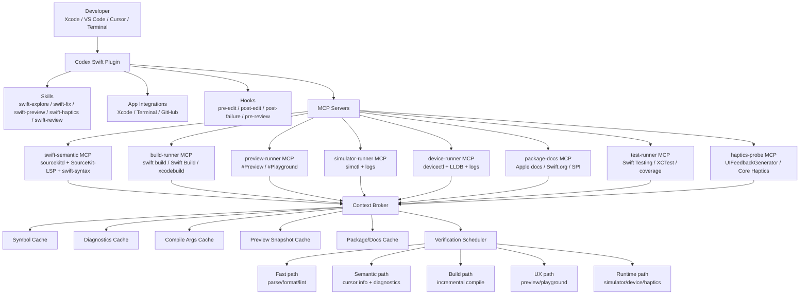
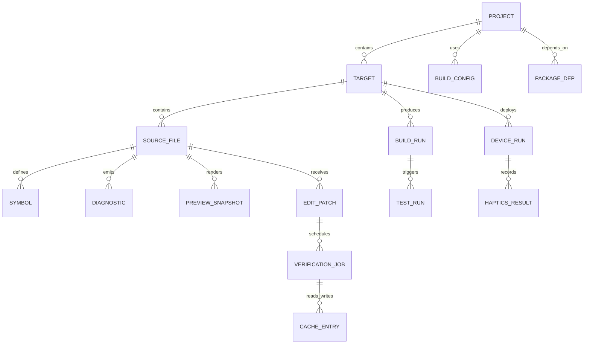
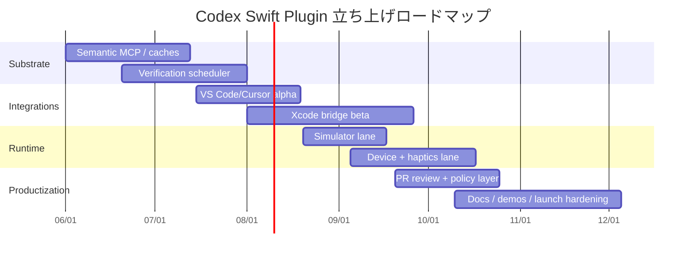

# Swift開発を加速するOpenAI Codexプラグイン立ち上げ資料

## エグゼクティブサマリー

AppleはXcodeに予測補完、生成AI、外部LLM/エージェント利用、Preview、Testing、Cloudを統合しつつ、Swift BuildやSourceKit-LSPのような基盤をオープンにしている。したがって、Swift向けの最適なCodexプラグインは「Xcodeの代替」ではなく、「CodexをSwiftの公式ツールチェーンに深く接続する橋渡し層」として設計するのが最も筋が良い。特に、Xcode 26系のCoding Toolsや#Playground macro、Swift 6.3系のツールチェーン拡張、Swift Build/SourceKit-LSPの整備は、探索的な実装ループを短くする方向を示している。 citeturn814973view4turn814973view3turn383596view0turn383596view2turn814973view2

本資料の提案は、Codex pluginを skills、hooks、app integrations、MCP servers の集合として実装し、その中核に `swift-semantic`、`build-runner`、`preview-runner`、`device-runner`、`package-docs`、`haptics-probe` を置く構成である。狙う価値は四つに絞る。第一に「vibe coding」向けの高速探索、第二にApple公式/Swift.org/SPIを横断したライブラリ発見、第三にfix-to-greenとCI/PR reviewの自動化、第四にSimulator/実機/ハプティクスまで含んだ短い検証ループである。 citeturn814973view4turn383596view2turn814973view2

予算とチームサイズは未指定のため、本資料の実装計画は Low / Medium / High の相対工数で表す。結論だけ先に言えば、最初の90日で必要なのは「モデル改善」より「意味論・ビルド・実行のsubstrate整備」であり、最初に作るべき成果物はXcode UIではなく `swift-semantic MCP` と `verification scheduler` である。Xcode bridge はその次に載せる。これはSwiftで最も時間を失う箇所が型・診断・ビルド・Preview・実機の接続部だからである。 [Swift Type Checker design](https://github.com/swiftlang/swift/blob/main/docs/TypeChecker.md), [Compiler Performance](https://github.com/swiftlang/swift/blob/master/docs/CompilerPerformance.md), [SourceKit-LSP](https://github.com/swiftlang/sourcekit-lsp)

## 価値提案と対象シナリオ

本プラグインの価値提案は「Swiftの探索的開発を止めないこと」であり、そのために、生成より検証、会話より意味論、全文脈より局所差分を優先する。AppleがXcode内でAI・Preview・Testingを統合しつつ、Swift BuildやSourceKit-LSPを開いていることからも、Swift向け製品戦略は「公式基盤を使って反復速度を上げる」方向で読むのが妥当である。 citeturn814973view4turn814973view3turn383596view2turn814973view2

| 想定シナリオ | 典型的な詰まりどころ | 提供価値 | 主要KPI | 一次ソース |
|---|---|---|---|---|
| vibe coding | SwiftUIの巨大式、型推論、build待ち、Preview未到達 | 変更を小さく保ち、parse → semantic → preview の順で段階検証 | time-to-first-semantic-answer、preview-pass@1 | [TypeChecker](https://github.com/swiftlang/swift/blob/main/docs/TypeChecker.md), [Xcode Preview](https://developer.apple.com/documentation/swiftui/previews-in-xcode), [Compiler Performance](https://github.com/swiftlang/swift/blob/master/docs/CompilerPerformance.md) |
| ライブラリ探索 | 何を入れるべきか分からない、互換性が不明 | Apple docs / Swift.org / Swift Package Index / Package Collections を統合検索 | package-choice latency、adoption success rate | [SwiftPM Package Collections](https://docs.swift.org/swiftpm/documentation/packagemanagerdocs/packagecollections/), [Swift Package Index](https://swiftpackageindex.com/) |
| fix-to-green | 変更後に型エラーが連鎖、Xcode build失敗 | sourcekitd/SourceKit-LSP診断を優先し、buildは後段に回す | compile-pass@1、rollback-rate | [SourceKit-LSP](https://github.com/swiftlang/sourcekit-lsp), [Compiler Performance](https://github.com/swiftlang/swift/blob/master/docs/CompilerPerformance.md) |
| CI/PR review | 差分レビューが浅い、Swiftらしい失敗を拾えない | Swift Testing/SwiftLint/build diagnosticsをPR reviewに接続 | review precision、false positive rate | [Swift Testing](https://github.com/swiftlang/swift-testing), [SwiftLint](https://github.com/realm/swiftlint) |
| 実機/ハプティクス | シミュレータでは十分検証できない | devicectl/LLDB/log captureと触覚smoke testを標準化 | device-smoke-pass、haptics-smoke-pass | [Core Haptics](https://developer.apple.com/documentation/corehaptics/preparing-your-app-to-play-haptics), [devicectl](https://developer.apple.com/documentation/xcode/installing-an-app-on-a-device), [SweetPad](https://github.com/sweetpad-dev/sweetpad) |

設計原則は単純で、`最短で見えるものを出す`、`失敗はもっと手前で小さく起こす`、`Swiftの正しさ判定はSwiftツールチェーンに委譲する`、`Xcodeを敵にしない` の四点である。これにより、Swiftでありがちな「LLMはたくさん書いたが、型エラーと実機確認で止まる」を避けやすい。 [TypeChecker](https://github.com/swiftlang/swift/blob/main/docs/TypeChecker.md), [Xcode](https://developer.apple.com/xcode/)

## 競争環境

公開一次資料を基準にみると、現状の市場には「AI本体」と「Swiftの足回り」が別々に存在する。Xcodeネイティブの近さではApple純正とGitHub Copilot for Xcodeが強く、エージェント性・構成柔軟性ではCodex、Cursor、Windsurf、Continue、Claude Code、Aiderが強い。一方で、Swift固有の意味論・Preview・実機・ハプティクスまでを一体化した公開プロダクトは確認しにくく、ここが主な空白である。 citeturn814973view4turn814973view3

| 区分 | 名称 | 提供元 | 主な機能 | Swift固有の強み | ライセンス/提供形態 | 一次情報 |
|---|---|---|---|---|---|---|
| AI/Xcode | Xcode Coding Intelligence / Coding Tools | Apple | 予測補完、自然言語編集、Preview、Testing連携 | Swift/Apple SDK向けオンデバイス補完、Xcode最短経路 | 商用配布 | [Xcode](https://developer.apple.com/xcode/) |
| AI/Codex | Codex CLI | OpenAI | エージェント型CLI、編集、実行、hooks、skills | SwiftPM/CLI駆動の試作に向く | OSS/配布、詳細は一次資料確認 | [Codex CLI](https://developers.openai.com/codex/cli) |
| AI/Codex | Codex IDE extension | OpenAI | IDE内チャット/編集、CLI設定共有 | SwiftではLSP・Xcode連携を足す前提 | 配布型拡張 | [Codex IDE](https://developers.openai.com/codex/ide) |
| AI/Desktop | ChatGPT Work with Apps | OpenAI | Xcodeなどの読取/差分適用 | Xcode編集中のペイン連携が強い | 商用アプリ | [Work with Apps](https://help.openai.com/en/articles/10119604-work-with-apps-on-macos) |
| AI/Xcode | GitHub Copilot for Xcode | GitHub | Completion、Chat、Agent Mode、MCP、Review | Xcode helper/bridge実装が見える | OSSクライアント + 商用サービス | [Copilot for Xcode](https://github.com/github/CopilotForXcode) |
| AI/IDE | GitHub Copilot | GitHub | multi-model chat、cloud agent、MCP、review | Xcode外ではワークスペース機能が厚い | 商用サービス | [Copilot docs](https://docs.github.com/copilot) |
| AI/IDE | Cursor | Anysphere | Agent、Rules、subagents、MCP、cloud agents | SweetPad併用でSwift実務可 | 商用IDE | [Cursor docs](https://cursor.com/docs) |
| AI/IDE | Windsurf | Cognition AI | Cascade、tool calling、rules、memories、MCP | 自動実行とコンテキスト制御に強い | 商用IDE | [Windsurf docs](https://docs.windsurf.com/) |
| AI/IDE | Continue | Continue Dev | Chat/Edit/Agent/Autocomplete、MCP、YAML構成 | 内製Swift agent試作に向く | Apache-2.0系OSS | [Continue docs](https://docs.continue.dev/reference) |
| AI/CLI | Aider | Aider-AI | repo map、lint/test loop、git編集 | SwiftPM中心の修正ループに強い | Apache-2.0系OSS | [Aider](https://github.com/Aider-AI/aider) |
| AI/CLI | Claude Code | Anthropic | skills、hooks、MCP、権限制御、CI | read-only default設計が参考になる | 商用ツール | [Claude Code](https://docs.anthropic.com/en/docs/claude-code/overview) |
| AI/Enterprise | Tabnine | Tabnine | Completion、Chat、Testing、PR review | VPC/オンプレ/air-gapped設計が参考 | 商用/私有配置 | [Tabnine docs](https://docs.tabnine.com/main) |
| Swift基盤 | SourceKit-LSP | Swift project | 補完、ジャンプ、インデックス、LSP | Swift意味論の中心 | Apache-2.0系OSS | [SourceKit-LSP](https://github.com/swiftlang/sourcekit-lsp) |
| Swift基盤 | xcode-build-server | SolaWing | Xcode projectをBSP化 | Xcode compile args をLSPへ渡せる | MIT系OSS | [xcode-build-server](https://github.com/SolaWing/xcode-build-server) |
| Swift基盤 | SweetPad | sweetpad-dev | VS Code/Cursorで build/run/debug/device | xcodebuild/sourcekit-lsp/devicectl 統合 | OSS | [SweetPad](https://github.com/sweetpad-dev/sweetpad) |
| Swift基盤 | SwiftPM / Swift Build | Swift project | package graph、build/test/doc、build基盤 | Swiftの共通build substrate | Apache-2.0系OSS | [SwiftPM](https://docs.swift.org/swiftpm/documentation/packagemanagerdocs/), [Swift Build](https://github.com/swiftlang/swift-build) |
| Swift基盤 | swift-syntax / swift-format | Swift project | parse/transform/format | AST安全編集の土台 | Apache-2.0系OSS | [swift-syntax](https://github.com/swiftlang/swift-syntax), [swift-format](https://github.com/swiftlang/swift-format) |
| Swift基盤 | Swift Testing | Swift project | macroベースのテスト | 生成・修正・検証の相性が良い | Apache-2.0系OSS | [Swift Testing](https://github.com/swiftlang/swift-testing) |
| Swift基盤 | SwiftLint | Realm | 静的解析、Build Tool Plugin | 変更後の高速ガード | MIT系OSS | [SwiftLint](https://github.com/realm/swiftlint) |
| 発見性 | Swift Package Index / Package Collections | SPI / SwiftPM | package検索、互換性、collection | ライブラリ探索の欠点を補う | 公開サービス/仕様 | [SPI](https://swiftpackageindex.com/), [Package Collections](https://docs.swift.org/swiftpm/documentation/packagemanagerdocs/packagecollections/) |

この表からの設計示唆は三つある。第一に、OpenAI Codexを採るなら、独自の意味論層を作るより `plugins + MCP + skills + hooks` でSwift固有機能を差し込むほうが自然である。第二に、Xcode bridgeは必須だが、Xcode単独では不十分で、SourceKit-LSP / Swift Build / xcodebuild / devicectl を並列に使う必要がある。第三に、企業導入を考えるなら、Claude CodeやTabnineに見られる read-only default、権限昇格、ゼロ保持、私有接続の考え方を最初から取り込むべきである。 [Codex Plugins](https://developers.openai.com/codex/plugins), [XcodeKit](https://developer.apple.com/documentation/xcodekit), [Tabnine](https://docs.tabnine.com/main), [Claude Code Security](https://docs.anthropic.com/en/docs/claude-code/security)

## 提案アーキテクチャ

提案アーキテクチャは、`Codex Swift Plugin = Skills + App Integrations + Hooks + MCP Servers + Context Broker + Verification Scheduler` である。AppleがXcodeでAIを前面に出しながらも、Swift BuildとSourceKit-LSPを開いていることを踏まえると、最適な構成は「編集面はXcodeとIDEに寄り添い、正しさ判定はSwiftの公式基盤に委譲する」形になる。 citeturn814973view4turn383596view2turn814973view2





| コンポーネント | 役割 | 実装候補 | 備考 |
|---|---|---|---|
| Xcode bridge | アクティブファイル取得、差分適用、コマンド起動 | helper app + Xcode Source Editor Extension + app integration | XcodeKitだけで足りない部分は外部プロセスで補う |
| Context Broker | 何をモデルへ渡すかを決める | symbol/diagnostic/preview/build/log を束ねるサービス | 全文脈ではなく、必要最小限を返す |
| Verification Scheduler | 検証順序の制御 | parse → semantic → build → preview → runtime | Swiftではここが生産性の中心 |
| Swift semantic MCP | 正しさの一次判定 | sourcekitd、SourceKit-LSP、swift-syntax | LSP不足時はsourcekitd에直接フォールバック |
| Build adapters | SwiftPM/Xcodeの両対応 | swift build / swift test / xcodebuild / Swift Build | compile args cacheを最優先 |
| Runtime lanes | 動作確認 | simctl、devicectl、LLDB、ログ収集 | 実機依存APIの確認コストを下げる |
| Package/docs MCP | 発見性 | Apple docs、Swift.org docs、SPI metadata | npm的な探索不足を補う |

このアーキテクチャの要点は、LLMの前にコンテキストブローカーを置くだけではなく、LLMの後にも検証スケジューラを置くことにある。Swiftでは生成の質と同じくらい「変更後にどこまで確かめるか」が重要で、ここを設計しないプラグインはvibe codingを加速しにくい。 [TypeChecker](https://github.com/swiftlang/swift/blob/main/docs/TypeChecker.md), [Compiler Performance](https://github.com/swiftlang/swift/blob/master/docs/CompilerPerformance.md)

## APIとスキル設計

公開情報上のCodex plugin primitivesを前提にすると、API面は「モデルに賢くさせる」より「Swiftの公式基盤から事実を取る」方向に寄せるべきである。つまり、型と診断は sourcekitd / SourceKit-LSP、構文変形は swift-syntax、整形は swift-format、ビルドは SwiftPM / xcodebuild、実行は simctl / devicectl、触覚は Core Haptics / UIFeedbackGenerator に委譲する。未公開の細部があるため、以下のJSON/TypeScript/YAMLは提案仕様であり、正式なCodex拡張スキーマが公開仕様と異なる部分は要調整とする。 [Codex Plugins](https://developers.openai.com/codex/plugins), [swift-syntax](https://github.com/swiftlang/swift-syntax)

```ts
export interface ProjectSummary {
  kind: "swiftpm" | "xcodeproj" | "xcworkspace" | "mixed";
  rootPath: string;
  targets: string[];
  schemes?: string[];
  platforms: string[];
  toolchain?: string;
}

export interface SymbolMatch {
  name: string;
  usr?: string;
  file: string;
  line: number;
  kind: string;
  container?: string;
}

export interface Diagnostic {
  file: string;
  line: number;
  column: number;
  severity: "note" | "warning" | "error";
  message: string;
  source: "sourcekit" | "lsp" | "build" | "lint" | "test";
}

export interface BuildResult {
  success: boolean;
  stage: "parse" | "typecheck" | "build" | "test";
  diagnostics: Diagnostic[];
  durationMs: number;
}

export interface PreviewResult {
  success: boolean;
  mode: "preview" | "playground";
  artifact?: string;
  durationMs: number;
}

export interface DeviceRunResult {
  success: boolean;
  destination: "simulator" | "device";
  logsPath?: string;
  durationMs: number;
}

export interface HapticsResult {
  success: boolean;
  api: "UIFeedbackGenerator" | "CoreHaptics";
  verifiedOnDevice: boolean;
  notes?: string;
}
```

```json
{
  "tool": "swift.build.incremental",
  "args": {
    "scheme": "MyApp",
    "changedFiles": ["Sources/HomeView.swift"],
    "stopAfter": "typecheck"
  }
}
```

```yaml
name: swift-explore
description: SwiftUIまたは非UIコードを最短で見える状態に持っていく
inputs:
  - user_goal
  - current_file
rules:
  - まず full build を避ける
  - UIコードは Preview を優先
  - 非UIコードは #Playground を優先
  - 失敗時は変更スコープを半分に縮める
  - package追加時は Apple docs / Swift.org / SPI を確認する
tools:
  - swift.project.describe
  - swift.symbol.search
  - swift.diagnostics.fresh
  - swift.edit.ast_transform
  - swift.build.incremental
  - swift.preview.refresh
success:
  - preview-pass@1
  - time-to-first-semantic-answer
```

```yaml
name: swift-fix
description: 最小差分でgreen compileへ戻す
inputs:
  - breaking_change_summary
  - changed_files
rules:
  - 変更ファイル数を最小化
  - sourcekit diagnostics を第一ソースにする
  - 巨大なSwiftUI式は分解を優先
  - 修正後に最低1本のテストまたはsmokeを追加
tools:
  - swift.diagnostics.fresh
  - swift.edit.ast_transform
  - swift.build.incremental
  - swift.test.generate_and_run
success:
  - compile-pass@1
  - rollback-rate
```

| スキル名 | 主用途 | 使うツール | 成功条件 |
|---|---|---|---|
| swift-explore | vibe coding、素早い試作 | semantic、preview、package-docs | first semantic answer と first preview |
| swift-fix | fix-to-green | diagnostics、ast_transform、build、test | compile-pass@1 |
| swift-preview | Preview/#Playground生成 | preview、build | preview-pass@1 |
| swift-haptics | 実機触覚追加 | device、haptics、logs | haptics-smoke-pass |
| swift-review | PRレビュー | diff、diagnostics、test、lint | review precision |
| swift-package-discovery | 依存候補探索 | package-docs、compatibility check | package-choice latency |

推奨プロンプトは自由入力一本ではなく、`goal`、`scope`、`stopAfter`、`safety`、`verificationBudget` を毎回持たせる。Swiftではこれがないと、モデルが変更範囲を広げすぎ、build待ちが増えやすい。 [Continue config patterns](https://docs.continue.dev/reference), [Aider repo map](https://github.com/Aider-AI/aider)

## 技術設計と主要リスク

Swiftで本当に効く技術設計は、`意味論取得`、`安全編集`、`増分検証`、`実行確認`、`権限制御` の五本柱で考えるべきである。AppleがXcodeにAIを統合しつつも、Swift BuildとSourceKit-LSPを外部利用可能な基盤として育てているため、この方向は中長期でも破綻しにくい。 citeturn814973view4turn383596view2turn814973view2

| 論点 | 技術方針 | 実装要点 | 主なリスク | 緩和策 | 一次ソース |
|---|---|---|---|---|---|
| sourcekitd / SourceKit-LSP統合 | まずLSP、必要時にsourcekitd直呼び | symbol search、cursor info、diagnostics freshness、background index利用 | Xcode projectではcompile args不足 | xcode-build-server、Xcode adapterで補う | [SourceKit-LSP](https://github.com/swiftlang/sourcekit-lsp), [xcode-build-server](https://github.com/SolaWing/xcode-build-server) |
| AST変換 | swift-syntax第一、text editは最後 | strict / balanced / text の3モード | 型情報のない変換不整合 | semantic verifyを直後に走らせる | [swift-syntax](https://github.com/swiftlang/swift-syntax), [swift-format](https://github.com/swiftlang/swift-format) |
| 増分コンパイル | parse → typecheck → build → test の段階制 | compile args cache、diagnostics cache、changed-files中心 | full buildへすぐ落ちる | stopAfter制御、scope shrink | [Compiler Performance](https://github.com/swiftlang/swift/blob/master/docs/CompilerPerformance.md), [Swift Build](https://github.com/swiftlang/swift-build) |
| diagnostics pipeline | semantic系とbuild系を別レーン運用 | まずsourcekit/lsp、次にlint/build/test | 診断ソースが混線する | source別severityとconfidenceを管理 | [SourceKit-LSP](https://github.com/swiftlang/sourcekit-lsp), [SwiftLint](https://github.com/realm/swiftlint) |
| Preview / Playground | UIはPreview、非UIは#Playgroundに逃がす | first visible resultを最優先 | Preview未到達で探索停止 | 自動でPlayground fallback | [Xcode](https://developer.apple.com/xcode/), [Previews](https://developer.apple.com/documentation/swiftui/previews-in-xcode) |
| Simulator / Device | simctlとdevicectlの二段運用 | simulator smoke、device smoke、log capture | 実機依存APIが最後に壊れる | device-run laneを標準化 | [SweetPad](https://github.com/sweetpad-dev/sweetpad), [Installing an app on a device](https://developer.apple.com/documentation/xcode/installing-an-app-on-a-device) |
| Haptics | まずUIFeedbackGenerator、足りなければCore Haptics | prepare()、実機確認、scenario化 | シミュレータで真価を見誤る | haptics-smokeを必須化 | [Core Haptics](https://developer.apple.com/documentation/corehaptics/preparing-your-app-to-play-haptics) |
| セキュリティ/プライバシー | read-only default、policy files、zero-retention mode | file edit / shell / simulator / device を別権限 | 社内コードや秘匿情報の流出 | allowlist、redaction、監査ログ、on-prem gateway | [Claude Code Security](https://docs.anthropic.com/en/docs/claude-code/security), [Tabnine deployment options](https://docs.tabnine.com/main) |
| Apple/Xcode API制限 | bridgeはXcode内外のハイブリッドにする | Source Editor Extension + helper app + app integration | 深いXcode内部APIが使えない | 外部プロセス中心に設計 | [XcodeKit](https://developer.apple.com/documentation/xcodekit) |
| ライセンス/提供モデル | OSS部分と商用部分を分離 | MCP/bridgeはOSS可、接続課金は商用 | 企業法務が導入を止める | コンポーネント分離、ライセンス表を維持 | 上表一次情報各種 |

推奨するキャッシュは五種類である。`compile-args cache`、`symbol cache`、`diagnostics cache`、`preview snapshot cache`、`package/docs cache` であり、キーは `toolchain + sdk + target/scheme + file hash + dependency graph hash` を基本にする。Swiftでは compile args の欠落と診断の古さが最も不快なため、ここに最初に投資すべきである。 [Compiler Performance](https://github.com/swiftlang/swift/blob/master/docs/CompilerPerformance.md), [SourceKit-LSP](https://github.com/swiftlang/sourcekit-lsp)

未確定事項も明示しておく。OpenAI側のplugin manifest / IDE integrationの将来仕様は公開情報の範囲では細部が未指定であり、Xcode側も将来のCoding Tools APIの公開範囲は未指定である。そのため、初期版は `Codex CLI/IDE + external MCP + Xcode helper` を基準にし、正式なXcode向け公開APIが拡大した時点で段階的に置き換えるのが安全である。 [Codex docs](https://developers.openai.com/codex), [Xcode](https://developer.apple.com/xcode/)

## 実装計画と立ち上げ運用

予算・チームサイズは未指定なので、ここでは工程を成果物ベースで切る。最初の成功条件は「Xcode内で派手に見えること」ではなく、「SwiftPMとXcode appの双方で、最初の意味論応答とgreen compileまでを短くできること」である。AppleがSwift BuildとSourceKit-LSPを公開基盤として整えている以上、ここを避けて通る理由はない。 citeturn383596view2turn814973view2

| マイルストーン | 期間の目安 | 工数感 | 成果物 | 受入条件 |
|---|---|---|---|---|
| semantic substrate | 0–6週 | Medium | `swift-semantic MCP`、symbol/diagnostics cache | SwiftPM sampleで time-to-first-semantic-answer を測定可能 |
| verification substrate | 4–10週 | Medium | `build-runner MCP`、stopAfter制御、lint/test lane | compile-pass@1 と rollback-rate を測定可能 |
| IDE alpha | 8–14週 | Low–Medium | Codex IDE/CLI連携、VS Code/Cursor実験版 | fix-to-green と package discovery が回る |
| Xcode bridge beta | 12–20週 | High | helper app、差分適用、アクティブファイル取得 | Xcode appで preview-pass@1 を測定可能 |
| runtime lanes | 16–24週 | Medium | simulator/device/haptics lane | device-smoke-pass、haptics-smoke-pass を測定可能 |
| review and governance | 20–28週 | Medium | PR review、policy files、audit logs | review precision、権限監査、redaction を評価可能 |
| launch hardening | 24–36週 | Medium | docs、demo、CI/QA、release criteria | 社内パイロット導入可能 |



| ベンチマーク指標 | 定義 | 初期目標 | 備考 |
|---|---|---|---|
| time-to-first-semantic-answer | sourcekit/lsp診断付き最初の返答まで | 10秒未満 | ローカル/CIで分離計測 |
| compile-pass@1 | 1回目の受理編集でbuild成功 | 50–70% | タスク難易度別に見る |
| preview-pass@1 | 1回目の受理編集でPreview/Playground成功 | 60%以上 | UI/非UIで別計測 |
| device-smoke-pass | 実機deploy/起動/log capture成功 | 70%以上 | 代表端末セットを固定 |
| haptics-smoke-pass | 触覚シナリオが実機で確認可能 | 80%以上 | UIFeedback系とCore Haptics系を分ける |
| rollback-rate | 受理後に取り消された編集割合 | 20%未満 | 開発者信頼度の代理指標 |
| token-cost-per-green-change | green compileまでの総コスト | 継続低減 | 成功率だけでなく効率を見る |

| 開発者オンボーディングチェック | 完了条件 |
|---|---|
| Xcode、Swift toolchain、Command Line Tools を揃えた | `xcodebuild -version` と `swift --version` が一致方針に沿う |
| SourceKit-LSPと必要なbridgeを認識した | `sourcekit-lsp --help` またはIDE連携が確認できる |
| plugin policy files を配置した | read-only default と権限昇格フローが有効 |
| sample workspace を開いた | SwiftPM package と Xcode workspace の両方で動作確認 |
| logs/cache ディレクトリを把握した | symbol/diagnostic/build cache の消去手順が分かる |
| demo scenarios を一巡した | preview、fix、package、PR review の基本ループを体験済み |

| CI/QAチェック | 完了条件 |
|---|---|
| semantic regression suite | symbol search と diagnostics freshness の差分検知 |
| build regression suite | stopAfter parse/typecheck/build の各段で再現性確認 |
| preview regression suite | Preview/Playgroundの最低成功件数を維持 |
| simulator/device suite | simulator smoke と device smoke の安定実行 |
| privacy/security suite | redaction、policy enforcement、audit logs の検証 |
| review quality suite | PR reviewのprecision/false positive を定点観測 |

| デモシナリオ | 目的 | 手順とコマンド | 期待値 |
|---|---|---|---|
| quick preview | 初回価値の実演 | `codex swift attach --workspace MyApp.xcworkspace --scheme MyApp` → `codex swift ask "この画面を最低限のPreview付きで実装"` → `codex swift preview --file Sources/HomeView.swift` | first semantic answer ≤ 10s、preview-pass@1 ≥ 0.6 |
| fix-to-green | 既存案件の現実的価値 | `codex swift diagnose --changed-files` → `codex swift fix --goal green` → `codex swift verify --stop-after build` → 必要なら `swift test` | compile-pass@1 ≥ 0.5、rollback-rate ≤ 0.2 |
| add haptics | 実機依存機能の見せ場 | `codex swift ask "成功時に軽い触覚を追加し、失敗時は強めの通知を入れる"` → `codex swift device smoke --scenario successTap` → 補助確認 `xcrun devicectl device info list` | device-smoke-pass ≥ 0.7、haptics-smoke-pass ≥ 0.8 |
| package discovery | 探索効率の差別化 | `codex swift package search "markdown parser"` → `codex swift package compare --platform ios --swift 6.0` → `codex swift apply package <candidate>` | package-choice latency の短縮、依存追加後のbuild成功 |
| PR review | チーム導入の実証 | `codex review pr 123 --skill swift-review` → `codex swift verify --stop-after test` | review precision 向上、false positive 低下 |

上の `codex swift ...` は提案CLI名であり、現時点の正式CLI仕様ではない。実装初期は既存Codex CLIの wrapper または MCP経由コマンドとして提供し、将来の公式拡張面に合わせて整理するのが良い。 [Codex CLI](https://developers.openai.com/codex/cli)

| 推奨一次ソース | 優先度 | 何を見るか |
|---|---|---|
| [Xcode](https://developer.apple.com/xcode/) | 最優先 | Appleの開発体験全体像、AI/Preview/Testing/Cloud |
| [What’s New in Xcode](https://developer.apple.com/xcode/whats-new/) | 最優先 | Coding Tools、#Playground、最新統合 |
| [XcodeKit](https://developer.apple.com/documentation/xcodekit) | 最優先 | Source Editor Extension の制約 |
| [Swift.org](https://www.swift.org/) | 最優先 | 言語・ツールチェーンの方向性 |
| [SourceKit-LSP](https://github.com/swiftlang/sourcekit-lsp) | 最優先 | LSPと意味論の実装現実 |
| [Swift Build](https://github.com/swiftlang/swift-build) | 最優先 | build substrate の将来 |
| [SwiftPM docs](https://docs.swift.org/swiftpm/documentation/packagemanagerdocs/) | 高 | package graph、collections |
| [swift-syntax](https://github.com/swiftlang/swift-syntax) | 高 | AST変換 |
| [Swift Testing](https://github.com/swiftlang/swift-testing) | 高 | 検証・テスト生成 |
| [Core Haptics](https://developer.apple.com/documentation/corehaptics/preparing-your-app-to-play-haptics) | 高 | 実機依存の触覚設計 |
| [OpenAI Codex overview](https://developers.openai.com/codex) | 最優先 | plugin/CLI/IDEの全体像 |
| [OpenAI Codex Plugins](https://developers.openai.com/codex/plugins) | 最優先 | skills、hooks、MCP、app integrations |
| [GitHub Copilot for Xcode](https://github.com/github/CopilotForXcode) | 高 | Xcode bridge 実装パターン |
| [SweetPad](https://github.com/sweetpad-dev/sweetpad) | 高 | Swift/iOSのVS Code統合実践 |
| [xcode-build-server](https://github.com/SolaWing/xcode-build-server) | 高 | Xcode compile args の橋渡し |

| エグゼクティブ1枚スライド案 | 記載内容 |
|---|---|
| タイトル | Swift vibe codingを止めないCodex plugin |
| 問題 | Swiftは型推論、build待ち、Preview未到達、実機依存で探索が止まりやすい |
| 解決策 | Codexに `swift-semantic + verification scheduler + Xcode bridge + device/haptics lanes` を追加 |
| 差別化 | Xcode/SwiftPM両対応、Apple docs/SPI統合探索、Preview/実機まで一気通貫 |
| 主要KPI | time-to-first-semantic-answer、compile-pass@1、preview-pass@1、device/haptics smoke |
| 初期成果物 | semantic substrate、build substrate、VS Code/Cursor alpha、Xcode bridge beta |
| リスク | Xcode API制約、プライバシー、企業導入、実機依存 |
| 要求判断 | まず90日でsubstrate投資、Xcode UIは第2波、権限制御は初期から実装 |

最終判断として、立ち上げ時点で最も重要なのは「Swift専用モデル」を探すことではなく、「Swiftの事実をSwiftの基盤から取り、その結果でCodexに計画・編集・縮退判断をさせる」ことである。Appleの最新の動きとSwift基盤の公開方針を見る限り、この設計が最も持続性が高く、かつvibe codingを本当に速くする。 citeturn814973view4turn814973view3turn383596view0turn383596view2turn814973view2